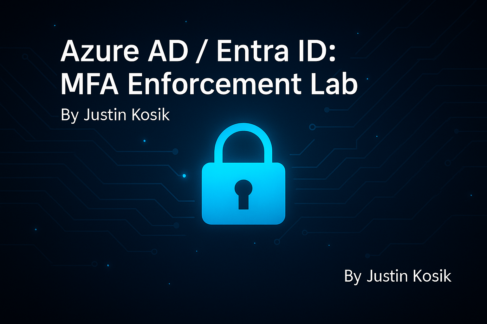

# Zero Trust Conditional Access Enforcement Lab (Entra ID / Azure AD)

<p align="center">
  
</p>

# Hands-on Zero Trust enforcement using Microsoft Entra ID Conditional Access<br>
## End-to-end identity protection lab replicating real IAM Engineer workflows.

<p>
  
  
  
</p>

---

## 📌 Table of Contents
- [Overview](#overview)
- [Lab Objectives](#lab-objectives)
- [Zero Trust Controls Implemented](#zero-trust-controls-implemented)
- [Architecture](#architecture)
- [Identity Groups](#identity-groups)
- [Named Locations](#named-locations)
- [Conditional Access Policies](#conditional-access-policies)
  - [Require MFA for All Users](#01--require-mfa-for-all-users)
  - [Block Non-US Locations](#02--block-non-us-countries)
  - [Block Legacy Authentication](#03--block-legacy-authentication)
- [Audit Verification Screenshots](#audit-verification-screenshots)
  - [Policy Enforcement Sign-ins](#policy-enforcement-sign-ins)
- [How to Deploy This Lab](#how-to-deploy-this-lab)
- [Professional Summary for Resume](#professional-summary-for-resume)

---

## Overview
This lab demonstrates Zero Trust access control enforcement using Microsoft Entra ID Conditional Access.

It applies real enterprise IAM requirements:

✔ Require MFA globally  
✔ Block legacy authentication  
✔ Geolocation enforcement  
✔ Exclusion of break-glass and admin accounts  
✔ Full audit evidence of successful policy behavior

---

## Lab Objectives
- Implement Zero Trust identity enforcement
- Configure Microsoft Conditional Access at enterprise standard
- Validate enforcement with live sign-in policy evidence
- Capture documentation suitable for **IAM portfolio & recruiter review**

---

## Zero Trust Controls Implemented
| Control | Framework Alignment |
|---------|---------------------|
| Require MFA | NIST 800-63-3 |
| Block Legacy Auth | MITRE ATT&CK T1110 Defense Evasion |
| Trusted Country Login | Zero Trust Identity Pillar |
| Emergency Access Accounts | Microsoft CA Governance Best Practice |

---

## Architecture
```
Tenant
│
├── Identity Groups
│   ├── GG-ZT-Admins
│   ├── GG-ZT-BreakGlass
│   └── GG-ZT-AllUsers
│
├── Named Location
│   └── United States (Country IP-based)
│
└── Conditional Access Policies
    ├── 01 – Require MFA for All Users
    ├── 02 – Block Non-US Countries
    └── 03 – Block Legacy Authentication
```

---

## Identity Groups

<details>
<summary><b>GG-ZT-Admins</b></summary>

Description: High-security admin baseline  
Members shown below:

```
Jax Orion
Justin Kosik
Sierra Nova
```

📸 **Screenshots**

- 
- screenshots/zt-group-admins-members.png

</details>

<details>
<summary><b>GG-ZT-BreakGlass</b></summary>

Description: Emergency exclusion account  
Members:

```
BreakGlass Emergency Admin
```

📸 Screenshots  
- screenshots/zt-group-breakglass-created.png  
- screenshots/zt-group-breakglass-members.png  

</details>

<details>
<summary><b>GG-ZT-AllUsers</b></summary>

Description: Default enforcement target group  
Members:

```
Dawsyn Echo
Eddie Spark
Jax Orion
Justin Kosik
Leah Vanta
Maverick Blaze
Nathan Dash
Sierra Nova
```

📸 Screenshots  
- screenshots/zt-group-allusers-created.png  
- screenshots/zt-group-allusers-members.png  

</details>

---

## Named Locations

<details>
<summary><b>United States (Trusted Country)</b></summary>

✔ Country-based named location  
✔ Used for explicit "Include/Exclude" enforcement

📸 Screenshot  
- screenshots/named-location-united-states.png

</details>

---

## Conditional Access Policies

---

### 01 – Require MFA for All Users
<details>
<summary><b>Policy Configuration Details</b></summary>

**Assignments**
- Users: All users (BreakGlass + Admin groups excluded)

**Grant Controls**
- Require MFA

📸 Screenshots  
```
screenshots/CA-Policy01-Assignments.png
screenshots/CA-Policy01-Conditions.png
screenshots/CA-Policy01-Grant.png
screenshots/CA-Policy01-Overview.png
```
</details>

---

### 02 – Block Non-US Countries
<details>
<summary><b>Policy Configuration Details</b></summary>

**Assignments**
- Users: All users (BreakGlass + Admins excluded)

**Conditions**
- Locations → Exclude ➜ United States

**Grant**
- Block access

📸 Screenshots  
```
screenshots/CA-Policy02-Assignments.png
screenshots/CA-Policy02-Conditions-Locations.png
screenshots/CA-Policy02-Overview.png
```

</details>

---

### 03 – Block Legacy Authentication
<details>
<summary><b>Policy Configuration Details</b></summary>

**Conditions**
- Client Apps → Legacy Auth Clients only

**Grant**
- Block access

📸 Screenshots  
```
screenshots/CA-Policy03-Assignments.png
screenshots/CA-Policy03-Conditions-ClientApps.png
screenshots/CA-Policy03-Grant.png
screenshots/CA-Policy03-Overview.png
```

</details>

---

## Audit Verification Screenshots
<details>
<summary><b>Non-US Login Test (Blocked) ✔</b></summary>

```
screenshots/05A-NonUS-Blocked-CAEvent.png
screenshots/05B-NonUS-Blocked-ErrorScreen.png
```
</details>

<details>
<summary><b>US Login Success Event ✔</b></summary>

```
screenshots/06A-USLogin-Success-CAEvent.png
```
</details>

---

## How to Deploy This Lab

```
1️⃣ Create three Azure AD security groups:
     GG-ZT-Admins
     GG-ZT-BreakGlass
     GG-ZT-AllUsers

2️⃣ Assign REAL user objects appropriately

3️⃣ Create named location "United States (Countries – IP)"

4️⃣ Build the three policies above in order:
     01 – Require MFA for All Users
     02 – Block Non-US Countries
     03 – Block Legacy Authentication

5️⃣ EXCLUDE:
     ❗ BreakGlass group
     ❗ Admin group

6️⃣ Validate:
     🔹 Sign-in logs
     🔹 Conditional Access tab
     🔹 Error screen evidence

```

---

## Professional Summary for Resume

```
• Designed and deployed enterprise-grade Zero Trust Conditional Access controls in Microsoft Entra ID
• Implemented global MFA enforcement with protected break-glass exclusion
• Built geolocation access control denying all non-US authentication attempts
• Eliminated legacy auth protocols to reduce credential attack surface
• Produced complete compliance evidence with policy events and sign-in artifacts
• Repository structured to match IAM engineer portfolio expectations
```

---

## ⭐ Recruiter-Facing Statement

> **This project demonstrates hands-on IAM engineering capability within modern Microsoft identity platforms, including real Conditional Access enforcement at Zero Trust standards. Evidence, policy state, and sign-in impact are fully captured for audit and operational review.**

