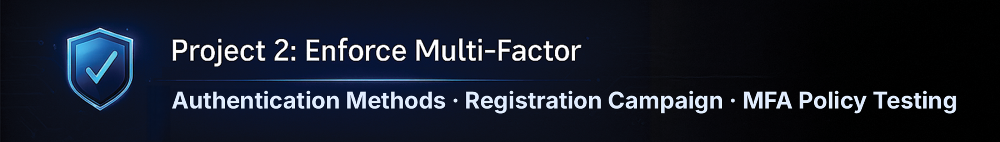
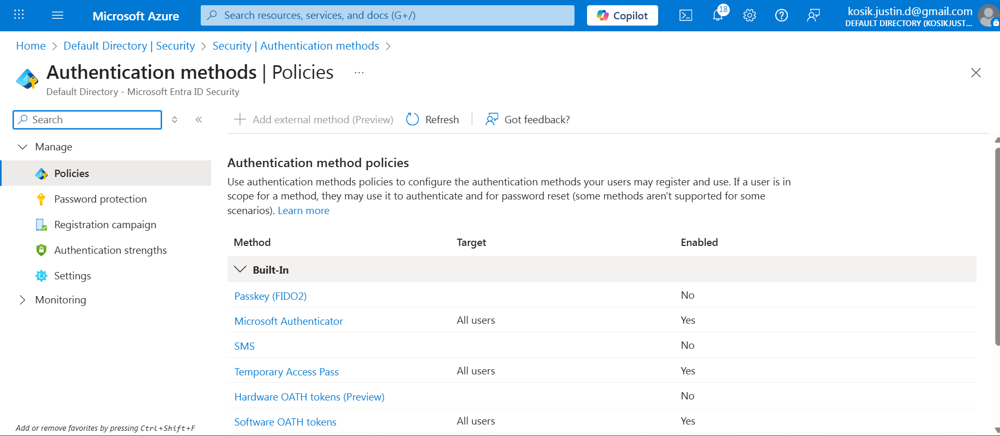
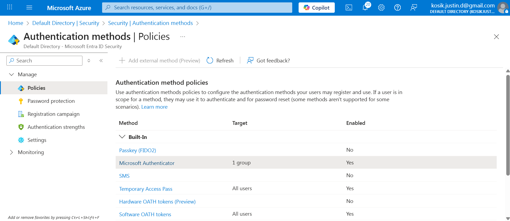
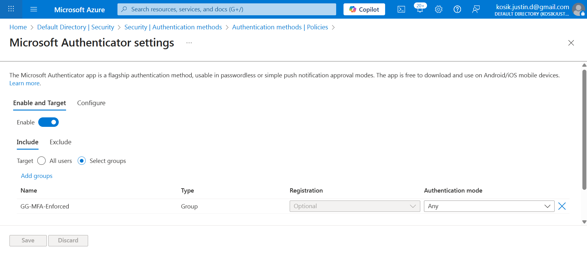
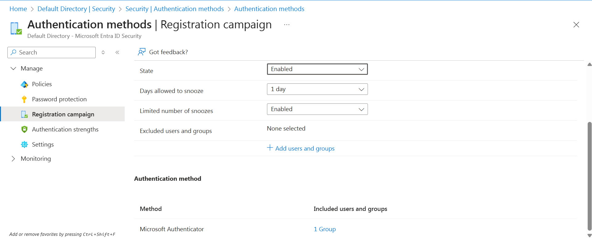
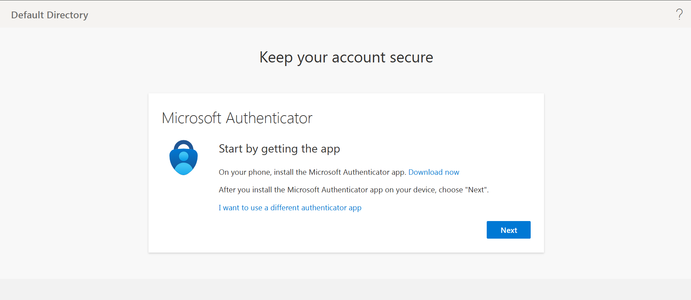
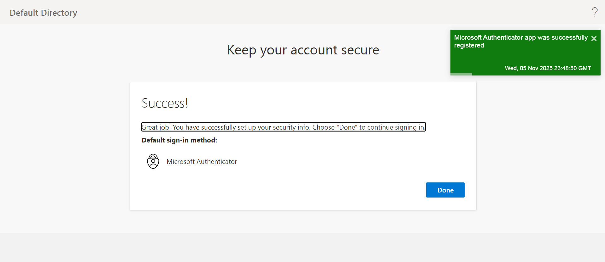
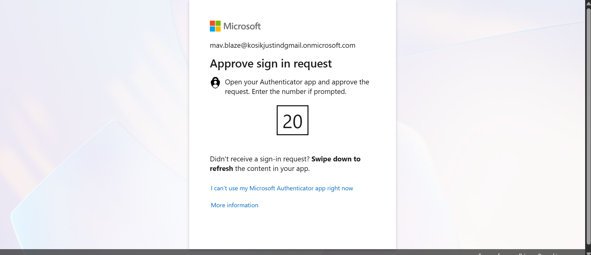

<p align="center">
  
</p>

<h1 align="center">🛡 Project 2 — Enforce Multi-Factor Authentication (MFA)</h1>
<h3 align="center">Microsoft Entra ID ▸ Zero Trust Authentication ▸ Enterprise IAM Lab</h3>

---

## 📌 Overview

This project implements **Multi-Factor Authentication (MFA) enforcement** inside Microsoft Entra ID as required by modern Zero Trust security frameworks.

The lab simulates **real IAM analyst responsibilities**, including:

✔ Designing secure authentication method policies  
✔ Targeting enforcement via identity-scoped groups  
✔ Blocking legacy insecure access paths  
✔ Capturing **audit-ready evidence** for compliance teams & hiring managers

This is **Project 2** in a 4-part enterprise IAM portfolio series.

---

## 📚 Table of Contents

- [Objectives](#-objectives)
- [Authentication Method Policies](#-authentication-method-policies)
- [Group-Targeted MFA Enforcement](#-group-targeted-mfa-enforcement)
- [Registration Campaign](#-registration-campaign-required-enrollment)
- [User Registration Experience](#-user-registration-experience)
- [MFA Authentication Test](#-mfa-authentication-test)
- [What I Learned](#-what-i-learned)
- [Next Project](#-next-project--identity-lifecycle-jml)
- [Repo Structure](#-repo-structure)

---

## 🎯 Objectives

| Objective | Outcome |
|-----------|---------|
| Enforce MFA | Microsoft Authenticator required |
| Control rollout | Enforcement limited to IAM MFA group |
| Verify Zero Trust | “Verify explicitly” enforced at sign-in |
| Capture audit evidence | Screenshots included for every control |

---

## 🔐 Authentication Method Policies

<details>
<summary><strong>📸 Authentication Method Policy View</strong></summary>



</details>

---

## 🎯 Group-Targeted MFA Enforcement

**Target Group:** `GG-MFA-Enforced`  
**Authentication Method:** Microsoft Authenticator  
**Mode:** Enabled

<details>
<summary><strong>📸 Microsoft Authenticator Policy Targeting</strong></summary>

  


</details>

---

## 🏁 Registration Campaign (Required Enrollment)

<details>
<summary><strong>📸 Registration Campaign Settings</strong></summary>



</details>

---

## 👤 User Registration Experience

<details>
<summary><strong>📸 User prompted for more information</strong></summary>



</details>

<details>
<summary><strong>📸 Authenticator success confirmation</strong></summary>



</details>

---

## 🧪 MFA Authentication Test

**User attempts sign-in → Forced MFA challenge**

<details>
<summary><strong>📸 Authentication Prompt</strong></summary>



</details>

---

## 🧠 What I Learned

✔ MFA MUST be enforced — **not just offered**  
✔ Group-based enforcement enables controlled rollout  
✔ Authentication Methods policy now replaces legacy MFA portal  
✔ Documentation is a **core IAM job skill**, not an afterthought  
✔ Audit evidence must show **policy → registration → successful enforcement**

---

## ➤ Next Project — Identity Lifecycle (JML)

**Joiners ▸ Movers ▸ Leavers ▸ Full Access Proven**

🔗 [Project 3 — Microsoft Entra ID Identity Lifecycle (JML)](https://github.com/CoachKosik/Project-3-Microsoft-Entra-ID-Identity-Lifecycle-JML/blob/main/README.md)

---

## 📂 Repo Structure

```text
entra-id-mfa-enforcement/
│ README.md
└── screenshots/
    ├─ mfa_banner.png
    ├─ auth-methods-policy.png
    ├─ mfa-authenticator-enabled.png
    ├─ mfa-authenticator-enabled-2.png
    ├─ mfa-registration-policy.png
    ├─ mfa-more-information-required.png
    ├─ mfa-registration-success.png
    ├─ mfa-authentication-prompt.png
```

⭐ STAR this repo if you're studying IAM<br>
🧑‍💼 Recruiters DO check GitHub activity<br>
🧠 Full portfolio → https://github.com/CoachKosik
